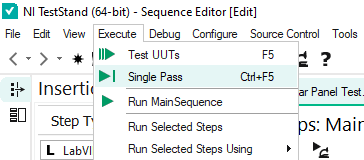

# Generating a Report

In this section example how you can use a __single pass executing entry point__ to generate a test report

## Single Pass
By using the __single pass__ execution method once the test has completed a report is displayed.

